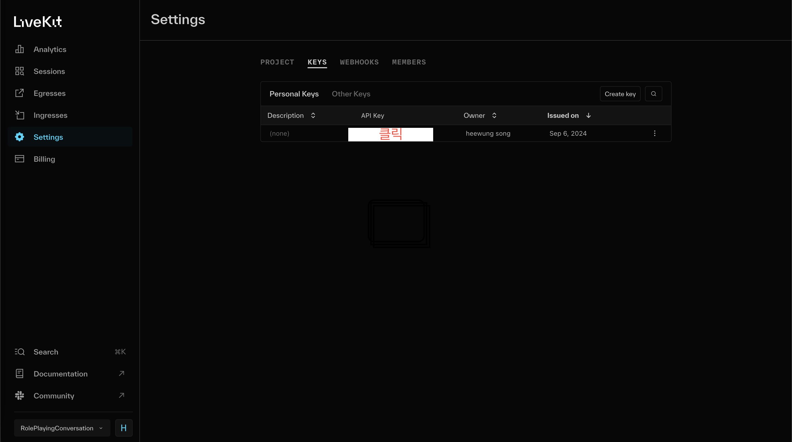

# LiveKit Agent 시작하기

이 가이드는 LiveKit Agent를 처음 시작하는 초보 개발자를 위한 것입니다. LiveKit Cloud를 통해 API 키를 발급받고, 개발 환경을 설정한 후, Agents Playground를 사용하여 테스트하는 과정을 안내합니다.

## 목차

1. LiveKit Cloud 계정 생성
2. 프로젝트 생성 및 API 키 발급
3. 개발 환경 설정
4. Agents Playground를 사용한 테스트

## 1. LiveKit Cloud 계정 생성

1. https://cloud.livekit.io 에 접속합니다.
2. "Sign in" 버튼을 클릭합니다[1].
3. Google, GitHub, GitLab 중 원하는 방식으로 계정을 생성합니다.

## 2. 프로젝트 생성 및 API 키 발급

1. LiveKit Cloud에 로그인 후, 새 프로젝트를 생성하라는 메시지가 표시됩니다.
2. 프로젝트 이름을 입력하고 생성합니다.
3. 프로젝트 대시보드에서 "Settings" 탭으로 이동합니다.
4. "API Keys" 섹션에서 새 API 키를 생성합니다.


5. 생성된 `LIVEKIT_API_KEY`와 `LIVEKIT_API_SECRET`을 안전한 곳에 저장합니다.
- .env 파일에 필요한 환경 변수를 설정합니다:
- LIVEKIT_URL: [WebSocket URL]
- LIVEKIT_API_KEY: [API Key]
- LIVEKIT_API_SECRET: [API Secret]
6. 대시보드 상단에서 프로젝트 URL을 확인하고 기록해둡니다.

## 3. 개발 환경 설정

1. server 폴더 디렉토리로 이동:
   ```
   cd server
   ```

2. .env 파일에 필요한 환경 변수를 설정합니다:
   ```
   LIVEKIT_URL=<your LiveKit project URL>
   LIVEKIT_API_KEY=<your API Key>
   LIVEKIT_API_SECRET=<your API Secret>
   ```

3. Python 가상 환경을 설정합니다(conda 사용하셔도 무방합니다.):
   ```
   python -m venv venv
   source venv/bin/activate
   ```

4. 필요한 Python 패키지를 설치합니다:
   ```
   pip install -r requirements.txt
   ```

5. Agent 워커를 실행합니다:
   ```
   python main.py dev
   ```
    
## 4. Agents Playground를 사용한 테스트

1. 웹 브라우저에서 https://agents-playground.livekit.io 에 접속합니다[2].

2. "Server URL" 필드에 LiveKit 프로젝트 URL을 입력합니다.

3. "Connect" 버튼을 클릭하여 룸에 접속합니다.

4. 마이크를 활성화하고 Agent와 대화를 시작합니다.

이제 LiveKit Agent를 설정하고 테스트하는 기본적인 과정을 완료했습니다. Agent의 동작을 확인하고 필요에 따라 코드를 수정하여 원하는 기능을 구현할 수 있습니다.

참고:
[1] https://cloud.livekit.io/login
[2] https://docs.livekit.io/agents/playground/
[3] https://ipv6.rs/tutorial/Windows_10/LiveKit/
[4] https://cloud.google.com/identity-platform/docs/sign-in-user-email?hl=ko
[5] https://cloud.google.com/docs/authentication/api-keys?hl=ko
[6] https://www.daddyprogrammer.org/tech-news/?vid=1006
[7] https://cloud.google.com/billing/docs/how-to/create-billing-account?hl=ko
[8] https://docs.livekit.io/agents/quickstart/
[9] https://docs.cloudtype.io/guide/references/apikey
[10] https://blog.livekit.io/mini-tutorial-setting-up-a-livekit-cloud-project/